# Sistem Shuttle Antar Kota

**Mini Project 2**  
**Praktikum Pemrograman Berorientasi Objek**

**Nama:** Zefri Al Rizqullah  
**NIM:** 2509116084

---

#### 1. Deskripsi Singkat Program

**Sistem Shuttle Antar Kota** merupakan program berbasis Java CLI (Command Line Interface) yang dirancang untuk mengelola proses layanan shuttle antar kota, mulai dari pengelolaan data penumpang, jadwal perjalanan, pemesanan, hingga tiket perjalanan.

Program memiliki tiga proses pengelolaan utama, yaitu data penumpang, jadwal shuttle, dan pemesanan. Penumpang dan jadwal dapat ditambah, ditampilkan, diubah, serta dihapus. Setiap data memiliki ID yang dibuat secara otomatis oleh sistem sehingga pengguna tidak perlu menentukan ID secara manual.

Pada proses pemesanan, pengguna memilih penumpang dan jadwal yang tersedia, menentukan jumlah tiket, kemudian memilih jenis Tiket Reguler atau Tiket Prioritas. Tiket Reguler mendapatkan kursi yang ditentukan otomatis oleh sistem, sedangkan Tiket Prioritas memungkinkan pengguna memilih sendiri kursi yang masih tersedia dengan tambahan biaya Rp25.000. Dalam konsep layanan nyata, tiket prioritas juga dapat menggambarkan layanan dengan benefit tambahan seperti lunch/snack, priority boarding, atau fasilitas khusus lainnya.

Setiap tiket yang berhasil dibuat memiliki nomor tiket unik dan terhubung dengan data penumpang, pemesanan, jadwal, serta nomor kursi. Kursi yang telah dipesan akan ditandai sebagai terisi dan tidak dapat digunakan oleh tiket lain. Jika pemesanan dibatalkan, kursi tersebut akan otomatis tersedia kembali.

Program juga menyediakan fitur pencarian tiket berdasarkan nomor tiket serta ringkasan statistik untuk melihat jumlah penumpang, jadwal, pemesanan, tiket Reguler dan Prioritas yang terjual, hingga total pendapatan. Pada awal program tersedia **dummy data** agar data dapat langsung ditampilkan tanpa harus melakukan input terlebih dahulu.

Seluruh data selama program berjalan dikelola menggunakan `ArrayList`. Program menggunakan struktur MVC (Model-View-Controller) untuk memisahkan pengelolaan data, proses program, dan tampilan. Selain itu, program menerapkan konsep encapsulation, inheritance, polymorphism, access modifier, validasi input, serta dilengkapi splash screen dan animasi loading agar tampilan program lebih terstruktur dan interaktif.

Secara sederhana, konsep kerja program dapat digambarkan sebagai berikut:

```text
Kelola Penumpang & Jadwal --> Buat Pemesanan --> Pilih Reguler / Prioritas --> Sistem Menentukan/Memilih Kursi --> Nomor Tiket Dibuat Otomatis --> Pemesanan Disimpan --> Cari Tiket & Lihat Statistik
```

---

## 2. Struktur Project dan Penerapan MVC

Program dikembangkan menggunakan struktur **MVC (Model-View-Controller)** agar kode lebih terorganisir dan setiap bagian memiliki tanggung jawab yang jelas.

Struktur package program adalah sebagai berikut:

> **Gambar 1. Struktur Package Project**

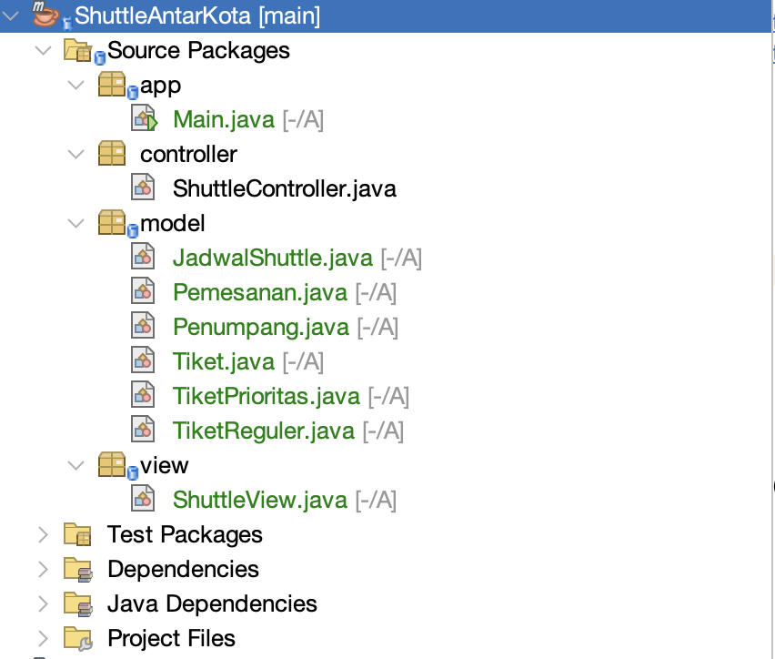

Struktur tersebut membagi program menjadi beberapa bagian berikut.

### 2.1 Package `model`

Package `model` berisi class yang digunakan untuk menyimpan dan mengatur data utama program.

Class yang terdapat di dalamnya adalah:

- `Penumpang` untuk data penumpang.
- `JadwalShuttle` untuk data jadwal, harga, kapasitas, dan kursi.
- `Pemesanan` untuk data transaksi pemesanan.
- `Tiket` sebagai superclass tiket.
- `TiketReguler` sebagai jenis tiket reguler.
- `TiketPrioritas` sebagai jenis tiket prioritas.

Pada bagian ini juga terdapat aturan dan validasi yang berkaitan langsung dengan data, seperti validasi nama, nomor HP, harga, jam keberangkatan, kapasitas, dan ketersediaan kursi.

### 2.2 Package `controller`

Package `controller` berisi `ShuttleController`.

Controller menjadi penghubung antara tampilan dan data. Bagian ini menangani proses utama seperti:

- Menambah, mencari, mengubah, dan menghapus data.
- Membuat ID secara otomatis.
- Membuat nomor tiket secara otomatis.
- Membuat pemesanan.
- Membuat Tiket Reguler dan Prioritas.
- Mengisi dan mengembalikan kursi.
- Menghitung jumlah tiket.
- Menghitung statistik dan pendapatan.

### 2.3 Package `view`

Package `view` berisi `ShuttleView`.

Bagian ini bertanggung jawab terhadap interaksi dengan pengguna, seperti:

- Menampilkan splash screen.
- Menampilkan menu.
- Menerima input.
- Menampilkan data.
- Memvalidasi format input.
- Menampilkan loading.
- Menampilkan hasil proses program.

Dengan demikian, tampilan program tidak dicampurkan seluruhnya ke dalam class model atau `Main`.

### 2.4 Package `app`

Package `app` berisi `Main.java` sebagai **entry point** program.

```java
ShuttleController controller = new ShuttleController();
ShuttleView view = new ShuttleView(controller);
view.jalankan();
```

`Main` hanya membuat object `ShuttleController`, menghubungkannya dengan `ShuttleView`, kemudian menjalankan program melalui method `jalankan()`.

Pembagian tersebut membuat `Main.java` tetap sederhana karena proses pengolahan data dilakukan Controller dan tampilan ditangani View. Dan dapat disimpulkan penerapan struktur MVC pada program ini sudah cukup baik.

---

# 3. Penjelasan Alur Program

## 3.1 Menjalankan Program dan Splash Screen

Ketika program pertama kali dijalankan, sistem menampilkan **Splash Screen** sebelum masuk ke menu utama.

Splash screen menampilkan nama aplikasi, judul sistem, proses `Starting System`, progress loading, dan pesan `System Ready!`.

Animasi dibuat menggunakan perulangan dan `Thread.sleep()`. Karakter `#` dicetak secara bertahap sehingga terlihat seperti progress loading.

> **Gambar 2. Tampilan Splash Screen dan Loading Sistem**

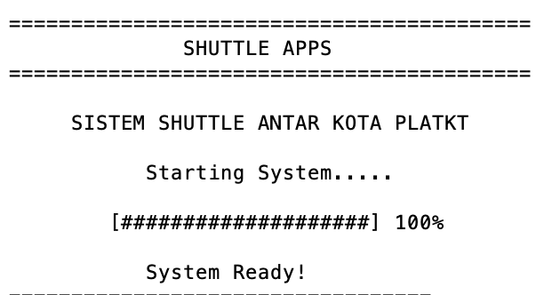

Splash screen berfungsi sebagai tampilan pembuka agar program lebih menarik dan interaktif sebelum pengguna masuk ke menu utama.

---

## 3.2 Menu Utama

Setelah splash screen selesai, pengguna masuk ke menu utama.

> **Gambar 3. Tampilan Menu Utama**

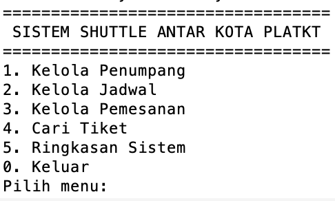

Program menggunakan perulangan `do-while`, sehingga menu akan terus ditampilkan selama pengguna belum memilih menu `0`.

Setiap pilihan menu juga divalidasi. Pengguna hanya dapat memasukkan angka sesuai pilihan yang tersedia.

---

# 4. Alur Kelola Penumpang

## 4.1 Menampilkan Penumpang

Saat program dibuat, Controller menjalankan method `isiDummyData()`.

Dengan demikian, pengguna dapat langsung memilih fitur **Tampilkan Penumpang** tanpa harus menambahkan data terlebih dahulu.

> **Gambar 4. Tampilan Data Penumpang**

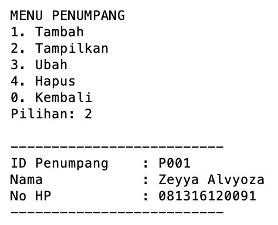

---

## 4.2 Menambah Penumpang

Pada menu tambah penumpang, pengguna hanya memasukkan:

- Nama.
- Nomor HP.

ID tidak perlu dimasukkan karena dibuat otomatis oleh sistem.

Contohnya:

> **Gambar 5. Proses Menambah Penumpang**

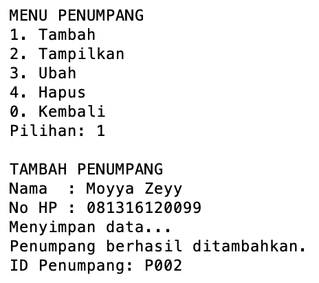

ID dibuat otomatis dengan format:

```text
P001
P002
P003
```

Dengan cara ini, pengguna tidak dapat memasukkan ID secara sembarangan dan kemungkinan ID duplikat dapat dihindari.

---

## 4.3 Mengubah Penumpang

Pengguna dapat memilih data berdasarkan ID penumpang kemudian memasukkan nama dan nomor HP yang baru.

> **Gambar 6. Proses Mengubah Data Penumpang**

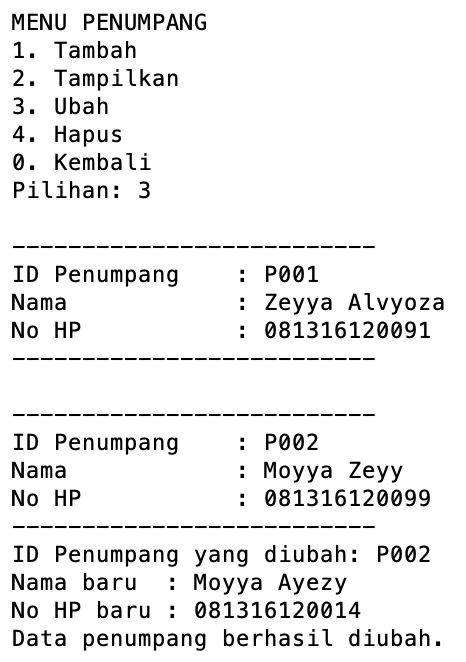

Nama dan nomor HP tetap melewati validasi sebelum perubahan diterima.

---

## 4.4 Menghapus Penumpang

Data penumpang dapat dihapus berdasarkan ID.

Namun, jika penumpang masih memiliki pemesanan aktif, data tidak dapat langsung dihapus.

> **Gambar 7. Validasi Penghapusan Penumpang**

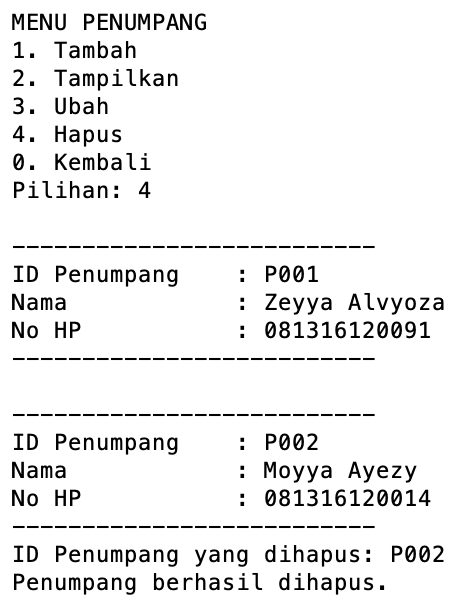

Validasi tersebut digunakan agar data pemesanan tidak kehilangan hubungan dengan data penumpangnya.

---

# 5. Alur Kelola Jadwal

## 5.1 Menampilkan Data Jadwal

Program telah menyediakan dummy data jadwal:

> **Gambar 8. Tampilan Dummy Data Jadwal**

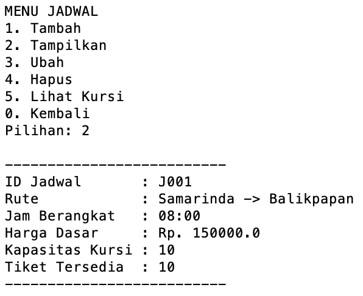

Dengan menampilkan keseluruhan data daei jadwal yang tersedia

---

## 5.2 Menambah Jadwal

Untuk menambahkan jadwal, pengguna memasukkan:

- Kota asal.
- Kota tujuan.
- Jam keberangkatan.
- Harga.
- Kapasitas kursi.

Contoh:

> **Gambar 9. Proses Menambah Jadwal**

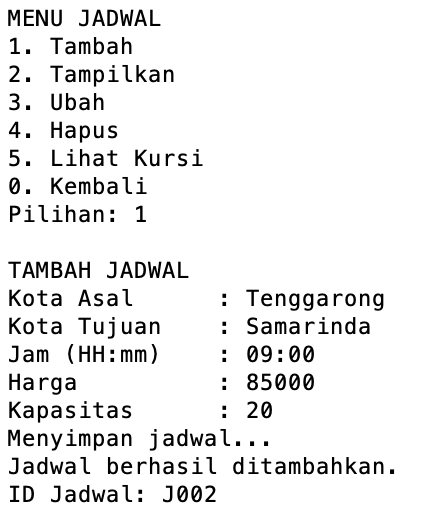

Program memastikan kota asal dan tujuan tidak sama, jam menggunakan format `HH:mm`, harga minimal Rp10.000, dan kapasitas berada antara 1 sampai 30 kursi.

ID jadwal juga dibuat otomatis dengan format:

```text
J001
J002
J003
```

---

## 5.3 Mengubah Jadwal

Data jadwal dapat diubah berdasarkan ID.

Pengguna dapat mengubah rute, jam keberangkatan, harga, dan kapasitas.

> **Gambar 10. Proses Mengubah Jadwal**

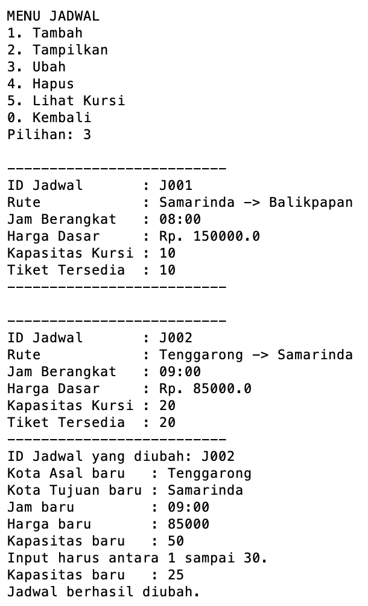

Kapasitas tidak dapat diubah secara sembarangan apabila perubahan tersebut bertentangan dengan kursi yang sudah digunakan.

---

## 5.4 Menghapus Jadwal

Jadwal dapat dihapus selama belum memiliki pemesanan.

Apabila masih terdapat pemesanan, sistem menolak penghapusan.

> **Gambar 11. Validasi Penghapusan Jadwal**

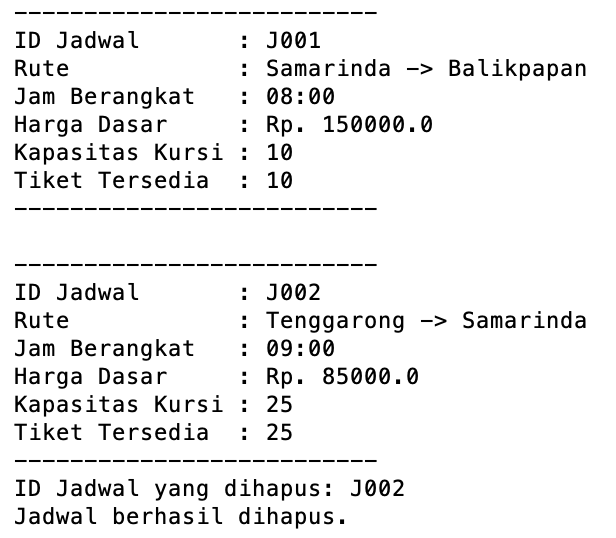

Hal ini menjaga agar tiket dan pemesanan yang sudah dibuat tetap memiliki data jadwal yang valid.

---

## 5.5 Melihat Ketersediaan Kursi

Setiap jadwal memiliki kapasitas dan daftar kursi yang telah digunakan.

Contoh kondisi awal:

```text
KETERSEDIAAN KURSI

[1] [2] [3] [4] [5]
[6] [7] [8] [9] [10]

X = Kursi sudah terisi
```

Setelah kursi 1 dan 5 digunakan:

```text
KETERSEDIAAN KURSI

[X] [2] [3] [4] [X]
[6] [7] [8] [9] [10]

X = Kursi sudah terisi
```

> **Gambar 12. Tampilan Ketersediaan Kursi**

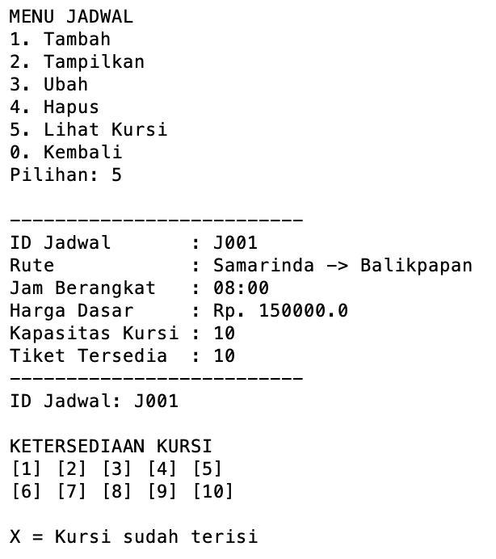

Jumlah tiket tersedia tidak disimpan secara terpisah, tetapi dihitung dari:

```text
Kapasitas Kursi - Jumlah Kursi Terisi
```

Dengan demikian, ketersediaan tiket selalu mengikuti kondisi kursi.

---

# 6. Alur Pemesanan Tiket

## 6.1 Memilih Penumpang dan Jadwal

Saat membuat pemesanan, pengguna terlebih dahulu memilih penumpang dari data yang tersedia. Lalu selanjutnya pengguna memilih jadwal.

> **Gambar 13. Proses Memilih Penumpang dan Jadwal**


Pengguna memilih berdasarkan nomor urut sehingga tidak perlu menghafal ID penumpang maupun ID jadwal.

---

## 6.2 Menentukan Jumlah dan Jenis Tiket

Setelah memilih jadwal, pengguna menentukan jumlah tiket.

Setiap tiket kemudian dapat dipilih sebagai:

> **Gambar 14. Pemilihan Jenis Tiket**


Pada Tiket Reguler, program mencari kursi kosong pertama secara otomatis.

Pada Tiket Prioritas, program menampilkan kursi yang tersedia dan pengguna dapat memilih kursi sendiri.

---

## 6.3 Pembuatan Nomor Tiket dan Pemesanan

Setiap tiket memperoleh nomor otomatis:

```text
TKT0001
TKT0002
TKT0003
```

Sedangkan pemesanan memiliki ID:

```text
PS001
PS002
PS003
```

Contoh hasil transaksi:

> **Gambar 15. Hasil Pemesanan Tiket**

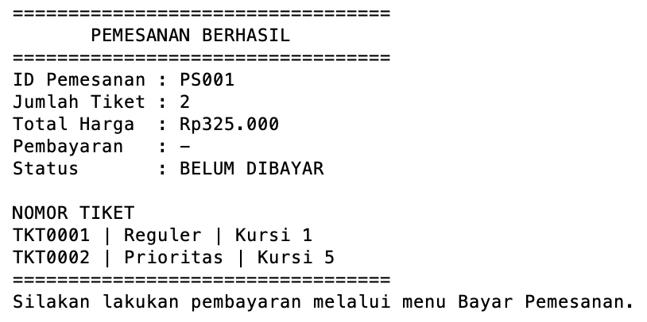

Total harga tidak disimpan sebagai angka tetap. Program menghitungnya dari seluruh tiket yang terdapat di dalam pemesanan melalui method `getTotalHarga()`.

---

## 6.4 Menampilkan Data Pemesanan

Menu tampil pemesanan menampilkan informasi pemesanan beserta tiket yang dimiliki.

> **Gambar 16. Tampilan Data Pemesanan**

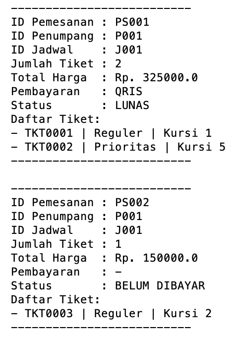

Satu pemesanan dapat memiliki beberapa object `Tiket` yang disimpan dalam `ArrayList<Tiket>`.

---

## 6.5 Membatalkan Pemesanan

Pemesanan dapat dibatalkan berdasarkan ID pemesanan.

Ketika pemesanan dibatalkan:

1. Program mencari pemesanan.
2. Program mencari jadwal yang digunakan.
3. Seluruh kursi dari tiket pada pemesanan dikosongkan kembali.
4. Pemesanan dihapus dari `ArrayList`.

> **Gambar 17. Proses Pembatalan Pemesanan**

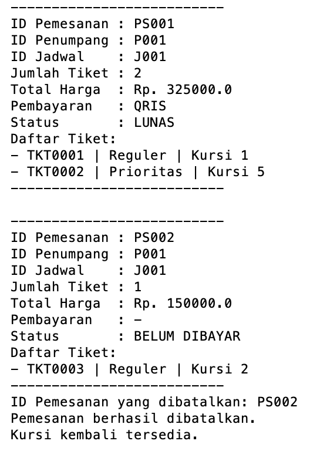

Dengan demikian, kursi yang sebelumnya digunakan dapat dipesan kembali oleh penumpang lain.

---

# 7. Alur Pencarian Tiket

Pengguna dapat mencari tiket dengan memasukkan nomor tiket.

Contoh:

```text
Nomor Tiket: TKT0002
```

Apabila tiket ditemukan, sistem menampilkan informasi tiket, penumpang, dan jadwal.

> **Gambar 18. Hasil Pencarian Tiket**

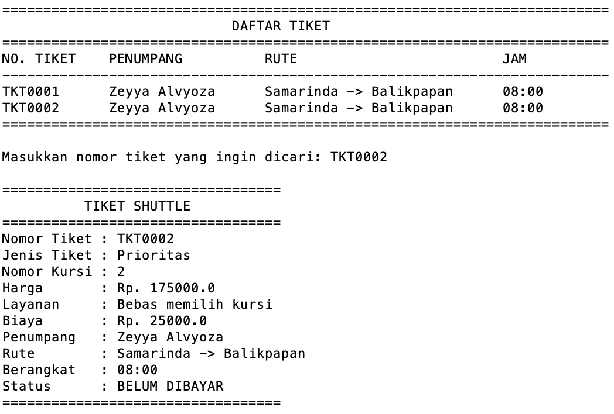

Jika nomor tiket tidak ditemukan, sistem menampilkan:

```text
Tiket tidak ditemukan.
```

Fitur ini menunjukkan bahwa nomor tiket yang dibuat otomatis juga berfungsi sebagai identitas untuk mencari tiket tertentu.

---

# 8. Ringkasan dan Statistik Sistem

Program menyediakan menu **Ringkasan Sistem** untuk menampilkan kondisi data dan hasil transaksi secara keseluruhan.

Informasi yang ditampilkan meliputi:

- Total penumpang.
- Total jadwal.
- Total pemesanan.
- Total tiket terjual.
- Jumlah Tiket Reguler.
- Jumlah Tiket Prioritas.
- Pendapatan dari Tiket Reguler.
- Pendapatan dari Tiket Prioritas.
- Total pendapatan.

Contoh:

> **Gambar 19. Tampilan Ringkasan dan Statistik Sistem**

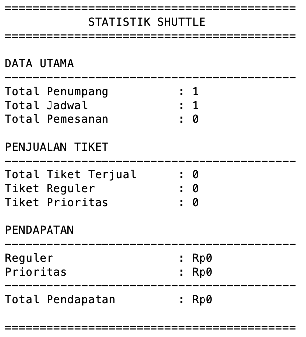

Nilai statistik dihitung berdasarkan data pemesanan dan tiket yang sedang tersimpan di dalam program, sehingga akan berubah mengikuti transaksi yang dilakukan.

---

# 9. Penerapan Validasi Input

Validasi diterapkan agar pengguna tidak dapat memasukkan data secara sembarangan dan mengurangi kemungkinan program mengalami error.

## 9.1 Validasi Input Menu

Method `inputInt()` menggunakan `try-catch` untuk memastikan input berupa angka.

Contoh jika pengguna memasukkan:

```text
Pilih menu: abc
Input harus berupa angka.
```

Jika pengguna memasukkan angka di luar pilihan:

```text
Pilih menu: 9
Input harus antara 0 sampai 5.
```

> **Gambar 20. Validasi Input Menu**

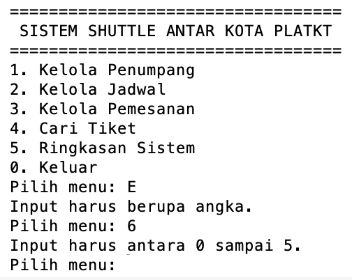

---

## 9.2 Validasi Data Penumpang

Nama tidak boleh kosong dan minimal terdiri dari 3 karakter.

Nomor HP hanya boleh berupa angka dengan panjang 10 sampai 15 digit.

Contoh:

```text
No HP : abc123
Nomor HP harus 10-15 digit angka.
```

Validasi dilakukan pada input View dan kembali diperiksa melalui setter pada Model.

---

## 9.3 Validasi Data Jadwal

Beberapa validasi yang diterapkan adalah:

- Kota asal dan tujuan tidak boleh kosong.
- Kota asal dan tujuan tidak boleh sama.
- Jam menggunakan format `HH:mm`.
- Harga minimal Rp10.000.
- Kapasitas antara 1 sampai 30 kursi.
- Kursi yang sudah digunakan tidak dapat dipilih kembali.
- Jadwal yang sudah memiliki pemesanan tidak dapat langsung dihapus.

> **Gambar 21. Contoh Validasi Data Program**


Validasi dilakukan pada beberapa bagian agar data yang masuk tetap sesuai aturan program.

---

# 10. Penerapan Encapsulation

Encapsulation diterapkan dengan membatasi akses langsung terhadap atribut menggunakan access modifier `private`.

Contohnya pada class `Penumpang`:

```java
private final String idPenumpang;
private String nama;
private String noHp;
```

Data kemudian diakses melalui getter:

```java
public String getNama() {
    return nama;
}
```

Sedangkan data yang dapat diubah menggunakan setter:

```java
public void setNama(String nama) {
    if (nama == null || nama.trim().isEmpty()) {
        throw new IllegalArgumentException(
                "Nama tidak boleh kosong."
        );
    }

    if (nama.trim().length() < 3) {
        throw new IllegalArgumentException(
                "Nama minimal 3 karakter."
        );
    }

    this.nama = nama.trim();
}
```

Setter tidak hanya digunakan untuk mengubah data, tetapi juga menjadi tempat validasi sebelum nilai disimpan ke atribut.

Beberapa atribut identitas menggunakan `final`, misalnya:

```java
private final String idPenumpang;
private final String idJadwal;
private final String idPemesanan;
private final String nomorTiket;
```

Artinya identitas tersebut ditentukan ketika object dibuat dan tidak dapat diubah setelahnya.

Dengan penerapan ini, data object lebih terlindungi karena perubahan dilakukan melalui aturan yang sudah ditentukan di dalam class.

---

# 11. Penerapan Inheritance

Inheritance diterapkan pada jenis tiket.

Hierarki class yang digunakan adalah:

> **Gambar 22. Hierarki Class Tiket**

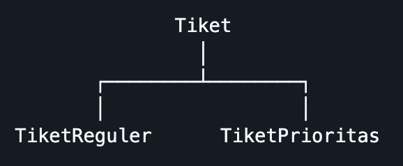

`Tiket` berfungsi sebagai **superclass**, sedangkan `TiketReguler` dan `TiketPrioritas` merupakan **subclass**.

Class `Tiket` menyimpan atribut umum yang dimiliki semua jenis tiket:

```java
private final String nomorTiket;
private final String idPemesanan;
private final String idPenumpang;
private final String idJadwal;
private final int nomorKursi;
private final double hargaDasar;
```

`TiketReguler` mewarisi `Tiket` menggunakan:

```java
public class TiketReguler extends Tiket
```

Begitu juga `TiketPrioritas`:

```java
public class TiketPrioritas extends Tiket
```

Dengan inheritance, atribut dan method yang sama tidak perlu ditulis ulang pada setiap jenis tiket.

Perbedaan perilaku kemudian ditempatkan pada masing-masing subclass.

---

# 12. Penerapan Polymorphism

Polymorphism menjadi salah satu nilai tambah pada program dan diterapkan.

Pemesanan menyimpan tiket menggunakan:

```java
private ArrayList<Tiket> daftarTiket;
```

Walaupun tipe ArrayList adalah `Tiket`, isinya dapat berupa object:

```text
TiketReguler
atau
TiketPrioritas
```

Kedua subclass melakukan **method overriding**.

Contohnya `getJenisTiket()` pada Tiket Reguler:

```java
@Override
public String getJenisTiket() {
    return "Reguler";
}
```

Sedangkan pada Tiket Prioritas:

```java
@Override
public String getJenisTiket() {
    return "Prioritas";
}
```

Tiket Prioritas juga melakukan override pada `hitungHarga()`:

```java
@Override
public double hitungHarga() {
    return getHargaDasar() + biayaPrioritas;
}
```

Ketika program menjalankan dijalankan hasilnya dapat berbeda sesuai object sebenarnya.

Jika object adalah `TiketReguler`, harga menggunakan harga dasar.

Jika object adalah `TiketPrioritas`, harga menjadi:

```text
Harga Dasar + Biaya Prioritas
```

Contoh:

```text
Harga Dasar       : Rp150.000
Biaya Prioritas   : Rp 25.000
Total Harga   : Rp175.000
```

Ini menunjukkan bahwa object dengan superclass yang sama dapat mempunyai perilaku berbeda sesuai subclass-nya.

---

# 13. Penerapan Access Modifier

Access modifier digunakan untuk mengatur bagian program yang dapat diakses dari class lain.

Access yang perlu digunakan oleh class lain menggunakan `public`.

contohnya:

```java
public Penumpang cariPenumpang(String id)
public JadwalShuttle cariJadwal(String id)
public Tiket cariTiket(String nomorTiket)
```

Sedangkan access yang hanya digunakan di dalam class menggunakan `private`.

```java
private String buatIdPenumpang()
private String buatIdJadwal()
private String buatIdPemesanan()
private String buatNomorTiket()
```

Jadi setiap bagian program memiliki batas akses sesuai kebutuhan.

---

# 14. Penerapan Dummy Data dan ArrayList

Data utama program disimpan menggunakan `ArrayList`.

```java
private ArrayList<Penumpang> daftarPenumpang;
private ArrayList<JadwalShuttle> daftarJadwal;
private ArrayList<Pemesanan> daftarPemesanan;
```

Saat `ShuttleController` dibuat, constructor menjalankan:

```java
isiDummyData();
```

Method tersebut langsung memasukkan satu penumpang dan satu jadwal awal.

```java
Penumpang penumpang = new Penumpang(
        buatIdPenumpang(),
        "Zeyya Alvyoza",
        "081316120091"
);

daftarPenumpang.add(penumpang);
```

dan:

```java
JadwalShuttle jadwal = new JadwalShuttle(
        buatIdJadwal(),
        "Samarinda",
        "Balikpapan",
        "08:00",
        150000,
        10
);

daftarJadwal.add(jadwal);
```

Tujuannya agar ketika fitur Tampilkan Data pertama kali dijalankan, program sudah mempunyai data yang dapat ditampilkan.

---

# 15. Penerapan Nilai Tambah

## 15.1 Struktur MVC

Program menerapkan struktur MVC dengan pemisahan:

```text
Model      --> menyimpan dan mengatur data
View       --> menampilkan program dan menerima input
Controller --> mengatur proses dan menghubungkan View dengan Model
Main       --> tempat dimana program utama dijalankan
```

Pemisahan tersebut membuat kode lebih terstruktur dibandingkan menempatkan seluruh proses di dalam `Main.java`.

---

## 15.2 Polymorphism

Polymorphism diterapkan melalui superclass `Tiket` dan subclass `TiketReguler` serta `TiketPrioritas`.

Method seperti:

```java
getJenisTiket()
hitungHarga()
tampilkanTiket()
```

dapat memberikan hasil berbeda sesuai jenis object tiket yang sedang digunakan.

---

## 15.3 Splash Screen dan Loading

Program memiliki splash screen saat pertama kali dijalankan.

Animasi loading dibuat menggunakan:

```java
for (int i = 0; i < 20; i++) {
    System.out.print("#");
    Thread.sleep(80);
}
```

Sedangkan efek teks `System Ready!` dibuat dengan menampilkan karakter satu per satu menggunakan `charAt()` dan `Thread.sleep()`.

Fitur ini tidak memengaruhi proses utama program, tetapi membuat tampilan CLI lebih interaktif.

---

## 16. Kesimpulan
**Sistem Shuttle Antar Kota** berhasil dibuat sebagai program berbasis Java CLI yang dapat mengelola proses layanan shuttle secara terstruktur, mulai dari pengelolaan data penumpang dan jadwal, pemesanan tiket, pengaturan ketersediaan kursi, pencarian tiket, hingga penyajian statistik sistem.

Program mampu menghubungkan setiap proses yang ada. Penumpang dapat memilih jadwal yang tersedia dan melakukan pemesanan menggunakan Tiket Reguler atau Tiket Prioritas. Setiap pemesanan menghasilkan nomor tiket dan nomor kursi yang dikelola secara otomatis. Kursi yang telah digunakan tidak dapat dipilih kembali, sedangkan pembatalan pemesanan akan mengembalikan kursi menjadi tersedia. Data transaksi tersebut juga digunakan untuk menghasilkan informasi jumlah tiket yang terjual dan total pendapatan pada ringkasan sistem.

Dari sisi struktur program, penggunaan **MVC** membuat pengelolaan data, proses, dan tampilan lebih terpisah dan terorganisir. Penerapan encapsulation, inheritance, polymorphism, access modifier, ArrayList, serta validasi input juga membuat program memiliki struktur OOP yang lebih jelas serta membantu menjaga data dan proses agar berjalan sesuai aturan yang telah ditentukan.

Secara keseluruhan, hasil akhir program tidak hanya mampu menjalankan fungsi pengelolaan data dan pemesanan shuttle, tetapi juga membentuk sebuah sistem sederhana yang saling terintegrasi antara penumpang, jadwal, pemesanan, tiket, kursi, dan statistik. Penambahan splash screen, loading, ID otomatis, dua jenis tiket, serta pengelolaan kursi membuat program lebih interaktif dan memberikan gambaran yang lebih nyata mengenai proses layanan shuttle antar kota.