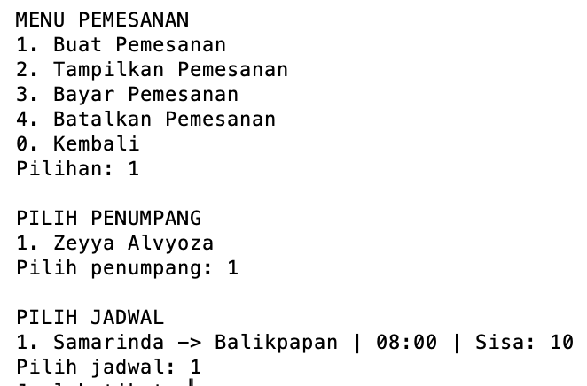
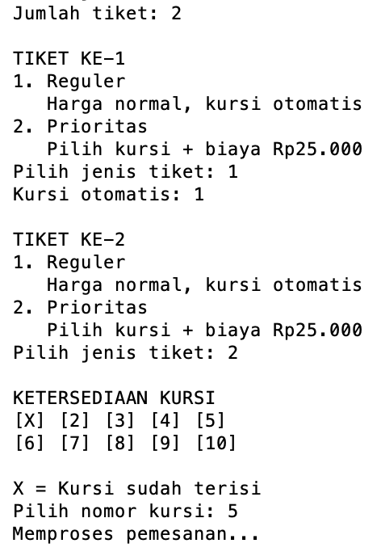
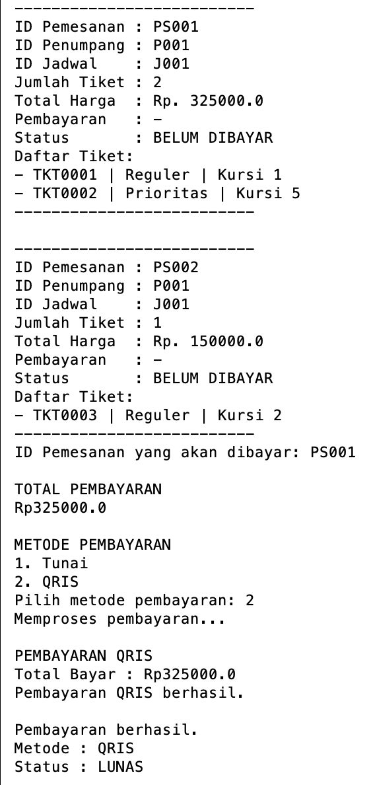
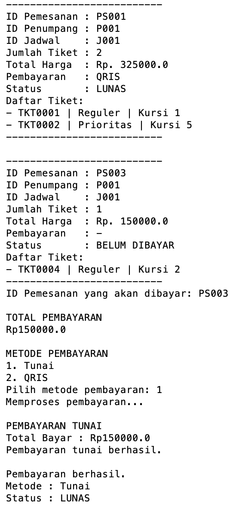
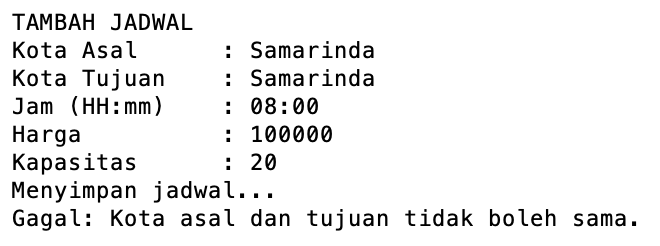
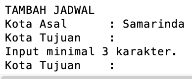
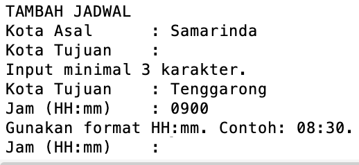

# Sistem Shuttle Antar Kota PLAT KT

**Mini Project 3**  
**Praktikum Pemrograman Berorientasi Objek**

**Nama:** Zefri Al Rizqullah  
**NIM:** 2509116084

---

#### 1. Deskripsi Singkat Program

**Sistem Shuttle Antar Kota PLAT KT** merupakan program berbasis Java CLI (Command Line Interface) yang dirancang untuk mengelola layanan shuttle antar kota, mulai dari pengelolaan data penumpang, jadwal perjalanan, pemesanan tiket, pembayaran, pencarian tiket, hingga penyajian statistik transaksi.

Program memiliki tiga proses pengelolaan utama, yaitu data penumpang, jadwal shuttle, dan pemesanan. Data penumpang dan jadwal dapat ditambah, ditampilkan, diubah, serta dihapus. Setiap data memiliki ID yang dibuat secara otomatis oleh sistem sehingga pengguna tidak perlu menentukan ID secara manual.

Pada proses pemesanan, pengguna memilih penumpang dan jadwal yang tersedia, menentukan jumlah tiket, kemudian memilih **Tiket Reguler** atau **Tiket Prioritas**. Tiket Reguler mendapatkan kursi yang ditentukan otomatis oleh sistem, sedangkan Tiket Prioritas memberikan kebebasan kepada pengguna untuk memilih kursi yang masih tersedia dengan tambahan biaya sebesar Rp25.000.

Setiap tiket memiliki nomor tiket unik dan terhubung dengan pemesanan, penumpang, jadwal, serta nomor kursi. Kursi yang telah digunakan akan ditandai sebagai terisi sehingga tidak dapat digunakan oleh tiket lainnya.

Proses pemesanan dan pembayaran dibuat secara terpisah. Setelah pemesanan berhasil dibuat, status awal pemesanan adalah **BELUM DIBAYAR**. Pengguna kemudian dapat memilih menu **Bayar Pemesanan** dan melakukan pembayaran menggunakan metode **Tunai** atau **QRIS**. Setelah proses pembayaran berhasil, status pemesanan berubah menjadi **LUNAS**.

Pemesanan yang belum dibayar masih dapat dibatalkan. Ketika pemesanan dibatalkan, kursi yang digunakan akan dikembalikan menjadi tersedia. Sedangkan pemesanan yang sudah berstatus LUNAS tidak dapat dibatalkan melalui proses pembatalan biasa.

Program juga menyediakan fitur pencarian tiket berdasarkan nomor tiket serta ringkasan statistik untuk melihat jumlah penumpang, jadwal, pemesanan, tiket yang telah terjual, jenis tiket, dan pendapatan. Data penjualan dan pendapatan dihitung berdasarkan transaksi yang telah berhasil dibayar.

Seluruh data selama program berjalan dikelola menggunakan `ArrayList`. Program menggunakan struktur **MVC (Model-View-Controller)** dan menerapkan konsep **encapsulation, inheritance, abstraction, polymorphism, access modifier, validasi input**, serta **interface** untuk menyediakan beberapa metode pembayaran.

Program juga dilengkapi splash screen, loading animation, ID otomatis, nomor tiket otomatis, pengelolaan kursi, dan dummy data awal agar penggunaan program lebih terstruktur dan interaktif.

Secara sederhana, alur utama program adalah:

```text
Kelola Penumpang & Jadwal --> Buat Pemesanan --> Pilih Reguler / Prioritas --> Sistem Menentukan/Memilih Kursi -->  Pemesanan Disimpan --> Status BELUM DIBAYAR --> Bayar Pemesanan --> Tunai / QRIS --> Status LUNAS --> Cari Tiket & Lihat Statistik
```

---

## 2. Struktur Project dan Penerapan MVC

Program dikembangkan menggunakan struktur **MVC (Model-View-Controller)** agar kode lebih terorganisir dan setiap bagian memiliki tanggung jawab yang jelas.

Struktur package program adalah sebagai berikut:

> **Gambar 1. Struktur Package Project**


Struktur tersebut membagi program menjadi beberapa bagian berikut.

### 2.1 Package `model`

Package `model` berisi class yang digunakan untuk menyimpan dan mengatur data utama program.

Class yang terdapat di dalamnya adalah:
- `Penumpang` untuk menyimpan data penumpang.
- `JadwalShuttle` untuk mengelola data jadwal, harga, kapasitas, dan ketersediaan kursi.
- `Pemesanan` untuk menyimpan transaksi pemesanan, daftar tiket, metode pembayaran, dan status pembayaran.
- `Tiket` sebagai **abstract superclass** untuk seluruh jenis tiket.
- `TiketReguler` sebagai subclass untuk tiket reguler.
- `TiketPrioritas` sebagai subclass untuk tiket prioritas.
- `Pembayaran` sebagai **interface** yang menentukan kontrak metode pembayaran.
- `PembayaranTunai` sebagai implementasi pembayaran menggunakan tunai.
- `PembayaranQRIS` sebagai implementasi pembayaran menggunakan QRIS.

Package `model` juga menangani beberapa aturan bisnis seperti perhitungan harga tiket, ketersediaan kursi, status pembayaran, serta proses pembayaran.

### 2.2 Package `controller`

Package `controller` berisi class `ShuttleController` yang menjadi penghubung antara View dengan Model.

Controller menangani proses seperti:

- Menambah, mencari, mengubah, dan menghapus data penumpang serta jadwal.
- Membuat ID penumpang, jadwal, pemesanan, dan nomor tiket secara otomatis.
- Membuat pemesanan.
- Membuat Tiket Reguler dan Tiket Prioritas.
- Mengatur penggunaan dan pengembalian kursi.
- Mencari data pemesanan dan tiket.
- Memproses pembayaran pemesanan melalui interface `Pembayaran`.
- Menghitung tiket yang telah terjual.
- Menghitung pendapatan berdasarkan pemesanan yang sudah dibayar.
- Menyediakan data statistik untuk ditampilkan oleh View.

### 2.3 Package `view`

Package `view` berisi `ShuttleView`.

Bagian ini bertanggung jawab terhadap interaksi dengan pengguna, seperti:

- Menampilkan splash screen.
- Menampilkan menu.
- Menerima input.
- Menampilkan data.
- Memvalidasi format input.
- Menampilkan loading.
- Menampilkan hasil proses program.

Dengan demikian, tampilan program tidak dicampurkan seluruhnya ke dalam class model atau `Main`.

### 2.4 Package `app`

Package `app` berisi `Main.java` sebagai **entry point** program.

```java
ShuttleController controller = new ShuttleController();
ShuttleView view = new ShuttleView(controller);
view.jalankan();
```

`Main` hanya membuat object `ShuttleController`, menghubungkannya dengan `ShuttleView`, kemudian menjalankan program melalui method `jalankan()`.

Pembagian tersebut membuat `Main.java` tetap sederhana karena proses pengolahan data dilakukan Controller dan tampilan ditangani View. Dan dapat disimpulkan penerapan struktur MVC pada program ini sudah cukup baik.

---

# 3. Penjelasan Alur Program

## 3.1 Menjalankan Program dan Splash Screen

Ketika program pertama kali dijalankan, sistem menampilkan **Splash Screen** sebelum masuk ke menu utama.

Splash screen menampilkan nama aplikasi, judul sistem, proses `Starting System`, progress loading, dan pesan `System Ready!`.

Animasi dibuat menggunakan perulangan dan `Thread.sleep()`. Karakter `#` dicetak secara bertahap sehingga terlihat seperti progress loading.

> **Gambar 2. Tampilan Splash Screen dan Loading Sistem**


Splash screen berfungsi sebagai tampilan pembuka agar program lebih menarik dan interaktif sebelum pengguna masuk ke menu utama.

---

## 3.2 Menu Utama

Setelah splash screen selesai, pengguna masuk ke menu utama.

> **Gambar 3. Tampilan Menu Utama**


Program menggunakan perulangan `do-while`, sehingga menu akan terus ditampilkan selama pengguna belum memilih menu `0`.

Setiap pilihan menu juga divalidasi. Pengguna hanya dapat memasukkan angka sesuai pilihan yang tersedia.

---

# 4. Alur Kelola Penumpang

## 4.1 Menampilkan Penumpang

Saat program dibuat, Controller menjalankan method `isiDummyData()`.

Dengan demikian, pengguna dapat langsung memilih fitur **Tampilkan Penumpang** tanpa harus menambahkan data terlebih dahulu.

> **Gambar 4. Tampilan Data Penumpang**


---

## 4.2 Menambah Penumpang

Pada menu tambah penumpang, pengguna hanya memasukkan:

- Nama.
- Nomor HP.

ID tidak perlu dimasukkan karena dibuat otomatis oleh sistem.

Contohnya:

> **Gambar 5. Proses Menambah Penumpang**


ID dibuat otomatis dengan format:

```text
P001
P002
P003
```

Dengan cara ini, pengguna tidak dapat memasukkan ID secara sembarangan dan kemungkinan ID duplikat dapat dihindari.

---

## 4.3 Mengubah Penumpang

Pengguna dapat memilih data berdasarkan ID penumpang kemudian memasukkan nama dan nomor HP yang baru.

> **Gambar 6. Proses Mengubah Data Penumpang**


Nama dan nomor HP tetap melewati validasi sebelum perubahan diterima.

---

## 4.4 Menghapus Penumpang

Data penumpang dapat dihapus berdasarkan ID.

Namun, jika penumpang masih memiliki pemesanan aktif, data tidak dapat langsung dihapus.

> **Gambar 7. Validasi Penghapusan Penumpang**


Validasi tersebut digunakan agar data pemesanan tidak kehilangan hubungan dengan data penumpangnya.

---

# 5. Alur Kelola Jadwal

## 5.1 Menampilkan Data Jadwal

Program telah menyediakan data jadwal:

> **Gambar 8. Tampilan Data Jadwal**


Dengan menampilkan keseluruhan data daei jadwal yang tersedia

---

## 5.2 Menambah Jadwal

Untuk menambahkan jadwal, pengguna memasukkan:

- Kota asal.
- Kota tujuan.
- Jam keberangkatan.
- Harga.
- Kapasitas kursi.

Contoh:

> **Gambar 9. Proses Menambah Jadwal**


Program memastikan kota asal dan tujuan tidak sama, jam menggunakan format `HH:mm`, harga minimal Rp10.000, dan kapasitas berada antara 1 sampai 30 kursi.

ID jadwal juga dibuat otomatis dengan format:

```text
J001
J002
J003
```

---

## 5.3 Mengubah Jadwal

Data jadwal dapat diubah berdasarkan ID.

Pengguna dapat mengubah rute, jam keberangkatan, harga, dan kapasitas.

> **Gambar 10. Proses Mengubah Jadwal**


Kapasitas tidak dapat diubah secara sembarangan apabila perubahan tersebut bertentangan dengan kursi yang sudah digunakan.

---

## 5.4 Menghapus Jadwal

Jadwal dapat dihapus selama belum memiliki pemesanan.

Apabila masih terdapat pemesanan, sistem menolak penghapusan.

> **Gambar 11. Validasi Penghapusan Jadwal**


Hal ini menjaga agar tiket dan pemesanan yang sudah dibuat tetap memiliki data jadwal yang valid.

---

## 5.5 Melihat Ketersediaan Kursi

Setiap jadwal memiliki kapasitas dan daftar kursi yang telah digunakan.

Contoh kondisi awal:

```text
KETERSEDIAAN KURSI

[1] [2] [3] [4] [5]
[6] [7] [8] [9] [10]

X = Kursi sudah terisi
```

Setelah kursi 1 dan 5 digunakan:

```text
KETERSEDIAAN KURSI

[X] [2] [3] [4] [X]
[6] [7] [8] [9] [10]

X = Kursi sudah terisi
```

> **Gambar 12. Tampilan Ketersediaan Kursi**


Jumlah tiket tersedia tidak disimpan secara terpisah, tetapi dihitung dari:

```text
Kapasitas Kursi - Jumlah Kursi Terisi
```

Dengan demikian, ketersediaan tiket selalu mengikuti kondisi kursi.

---

# 6. Alur Pemesanan Tiket

## 6.1 Memilih Penumpang dan Jadwal

Saat membuat pemesanan, pengguna terlebih dahulu memilih penumpang dari data yang tersedia. Lalu selanjutnya pengguna memilih jadwal.

> **Gambar 13. Proses Memilih Penumpang dan Jadwal**



Pengguna memilih berdasarkan nomor urut sehingga tidak perlu menghafal ID penumpang maupun ID jadwal.

---

## 6.2 Menentukan Jumlah dan Jenis Tiket

Setelah memilih jadwal, pengguna menentukan jumlah tiket.

Setiap tiket kemudian dapat dipilih sebagai:

> **Gambar 14. Pemilihan Jenis Tiket**



Pada Tiket Reguler, program mencari kursi kosong pertama secara otomatis.

Pada Tiket Prioritas, program menampilkan kursi yang tersedia dan pengguna dapat memilih kursi sendiri.

---

## 6.3 Pembuatan Nomor Tiket dan Pemesanan

Setiap tiket memperoleh nomor otomatis:

```text
TKT0001
TKT0002
TKT0003
```

Sedangkan pemesanan memiliki ID:

```text
PS001
PS002
PS003
```

Contoh hasil transaksi:

> **Gambar 15. Hasil Pemesanan Tiket**


Total harga tidak disimpan sebagai angka tetap. Program menghitungnya dari seluruh tiket yang terdapat di dalam pemesanan melalui method `getTotalHarga()`.

---

## 6.4 Menampilkan Data Pemesanan

Menu tampil pemesanan menampilkan informasi pemesanan beserta tiket yang dimiliki, serta juga menampilkan status pembayaran.

> **Gambar 16. Tampilan Data Pemesanan**


Satu pemesanan dapat memiliki beberapa object `Tiket`.

---

## 6.5 Melakukan Pembayaran Pemesanan

Pembayaran dilakukan secara terpisah setelah pemesanan berhasil dibuat.

> **Gambar 17. Proses Pembayaran QRIS**



Proses ketika pengguna memilih pembayaran dan memperoleh informasi bahwa pembayaran berhasil dengan menggunakan metode QRIS.

> **Gambar 18. Proses Pembayaran Tunai**



Proses ketika pengguna memilih pembayaran dan memperoleh informasi bahwa pembayaran berhasil dengan menggunakan metode Tunai.

---

## 6.6 Membatalkan Pemesanan

Pemesanan dapat dibatalkan berdasarkan ID pemesanan selama transaksi tersebut **belum dibayar**.

Ketika pengguna melakukan pembatalan, program menjalankan beberapa proses:

1. Mencari pemesanan berdasarkan ID.
2. Memastikan pemesanan ditemukan.
3. Memeriksa status pembayaran.
4. Mencari jadwal yang digunakan oleh pemesanan.
5. Mengembalikan seluruh kursi dari tiket menjadi tersedia.
6. Menghapus pemesanan dari `ArrayList`.

Jika pemesanan sudah dibayar, sistem akan menolak pembatalan pemesanan.

> **Gambar 19. Proses Pembatalan Pemesanan**


Dengan itu, kursi yang sebelumnya digunakan dapat dipesan kembali oleh penumpang lain.

---

# 7. Ringkasan dan Statistik Sistem

Program menyediakan menu **Ringkasan Sistem** untuk menampilkan kondisi data dan hasil transaksi secara keseluruhan.

Informasi yang ditampilkan meliputi:

- Total penumpang.
- Total jadwal.
- Total pemesanan.
- Total tiket terjual.
- Jumlah Tiket Reguler.
- Jumlah Tiket Prioritas.
- Pendapatan dari Tiket Reguler.
- Pendapatan dari Tiket Prioritas.
- Total pendapatan.

Contoh:

> **Gambar 20. Tampilan Ringkasan dan Statistik Sistem**


Nilai statistik akan berubah mengikuti data dan transaksi yang dilakukan pada program. Khusus untuk **Total Tiket Terjual, Tiket Reguler, Tiket Prioritas, dan Pendapatan**, perhitungan hanya dilakukan terhadap pemesanan yang telah berstatus **LUNAS**. Pemesanan yang masih berstatus **BELUM DIBAYAR** belum dianggap sebagai transaksi penjualan yang selesai.

---

# 8. Pencarian Tiket

Menu **Cari Tiket** digunakan untuk mencari dan melihat informasi lengkap dari tiket yang telah dibuat pada proses pemesanan.

Ketika menu Cari Tiket dipilih, program terlebih dahulu menampilkan **daftar tiket yang tersedia**. Daftar tersebut berisi nomor tiket, nama penumpang, rute perjalanan, dan jam keberangkatan.

> **Gambar 21. Tampilan Pencarian Tiket**


Apabila nomor tiket yang dimasukkan tidak ditemukan, program akan memberikan informasi bahwa tiket tersebut tidak tersedia. Sedangkan jika belum terdapat tiket yang dapat dicari, program akan meminta pengguna membuat pemesanan terlebih dahulu.

Fitur ini mempermudah pengguna dalam mengetahui tiket yang tersedia dan melihat informasi tiket secara lengkap tanpa harus membuka seluruh data pemesanan.

---

# 9. Penerapan Validasi Input

Validasi diterapkan agar pengguna tidak dapat memasukkan data secara sembarangan dan mengurangi kemungkinan program mengalami error.

## 9.1 Validasi Input Menu

Method `inputInt()` menggunakan `try-catch` untuk memastikan input berupa angka.

Contoh jika pengguna memasukkan:

```text
Pilih menu: abc
Input harus berupa angka.
```

Jika pengguna memasukkan angka di luar pilihan:

```text
Pilih menu: 9
Input harus antara 0 sampai 5.
```

> **Gambar 22. Validasi Input Menu**


---

## 9.2 Validasi Data Penumpang

Nama tidak boleh kosong dan minimal terdiri dari 3 karakter.

Nomor HP hanya boleh berupa angka dengan panjang 10 sampai 15 digit.

Contoh:

```text
No HP : abc123
Nomor HP harus 10-15 digit angka.
```

Validasi dilakukan pada input View dan kembali diperiksa melalui setter pada Model.

---

## 9.3 Validasi Data Jadwal

Beberapa validasi yang diterapkan adalah:

- Kota asal dan tujuan tidak boleh kosong.
- Kota asal dan tujuan tidak boleh sama.
- Jam menggunakan format `HH:mm`.
- Harga minimal Rp10.000.
- Kapasitas antara 1 sampai 30 kursi.
- Kursi yang sudah digunakan tidak dapat dipilih kembali.
- Jadwal yang sudah memiliki pemesanan tidak dapat langsung dihapus.

> **Gambar 23. Contoh Salah Satu Validasi Data Program**





Validasi dilakukan pada beberapa bagian agar data yang masuk tetap sesuai aturan program.

---

# 10. Penerapan Encapsulation

Encapsulation diterapkan dengan membatasi akses langsung terhadap atribut menggunakan access modifier `private`.

Contohnya pada class `Penumpang`:

```java
private final String idPenumpang;
private String nama;
private String noHp;
```

Data kemudian diakses melalui getter:

```java
public String getNama() {
    return nama;
}
```

Sedangkan data yang dapat diubah menggunakan setter:

```java
    public void setNama(String nama) {
        if (nama == null || nama.trim().isEmpty()) {
            throw new IllegalArgumentException("Nama tidak boleh kosong.");
        }

        if (nama.trim().length() < 3) {
            throw new IllegalArgumentException("Nama minimal 3 karakter.");
        }
        this.nama = nama.trim();
    }
```

Setter tidak hanya digunakan untuk mengubah data, tetapi juga menjadi tempat validasi sebelum nilai disimpan ke atribut.

Beberapa atribut identitas menggunakan `final`, misalnya:

```java
private final String idPenumpang;
private final String idJadwal;
private final String idPemesanan;
private final String nomorTiket;
```

Artinya identitas tersebut ditentukan ketika object dibuat dan tidak dapat diubah setelahnya.

Dengan penerapan ini, data object lebih terlindungi karena perubahan dilakukan melalui aturan yang sudah ditentukan di dalam class.

---

# 11. Penerapan Inheritance

Inheritance diterapkan pada pengelompokan jenis tiket. Program memiliki `Tiket` sebagai **abstract superclass**, sedangkan `TiketReguler` dan `TiketPrioritas` menjadi subclass.

Hubungannya dapat digambarkan sebagai berikut:

> **Gambar 24. Hierarki Class Tiket**


`Tiket` berfungsi sebagai **superclass**, sedangkan `TiketReguler` dan `TiketPrioritas` merupakan **subclass**.

Class `Tiket` menyimpan atribut umum yang dimiliki semua jenis tiket:

```java
private final String nomorTiket;
private final String idPemesanan;
private final String idPenumpang;
private final String idJadwal;
private final int nomorKursi;
private final double hargaDasar;
```

`TiketReguler` mewarisi `Tiket` menggunakan:

```java
public class TiketReguler extends Tiket
```

Begitu juga `TiketPrioritas`:

```java
public class TiketPrioritas extends Tiket
```

Dengan inheritance, atribut dan method yang sama tidak perlu ditulis ulang pada setiap jenis tiket.

Perbedaan perilaku kemudian ditempatkan pada masing-masing subclass.

---

# 12. Penerapan Polymorphism

Polymorphism diterapkan ketika satu tipe referensi dapat digunakan untuk menangani object yang berbeda dan menjalankan perilaku sesuai object sebenarnya.

Pada program Sistem Shuttle Antar Kota, polymorphism dapat terlihat pada dua bagian, yaitu **jenis tiket** dan **metode pembayaran**.

## 12.1 Polymorphism pada Tiket

Class `Pemesanan` menyimpan seluruh tiket menggunakan:

```java
private ArrayList<Tiket> daftarTiket;
```

Walaupun tipe ArrayList adalah `Tiket`, isinya dapat berupa object:

```text
TiketReguler
atau
TiketPrioritas
```

Kedua subclass melakukan **method overriding**.

Contohnya `getJenisTiket()` pada Tiket Reguler:

```java
@Override
public String getJenisTiket() {
    return "Reguler";
}
```

Sedangkan pada Tiket Prioritas:

```java
@Override
public String getJenisTiket() {
    return "Prioritas";
}
```

Tiket Prioritas juga melakukan override pada `hitungHarga()`:

```java
@Override
public double hitungHarga() {
    return getHargaDasar() + biayaPrioritas;
}
```

Ketika program menjalankan dijalankan hasilnya dapat berbeda sesuai object sebenarnya.

Jika object adalah `TiketReguler`, harga menggunakan harga dasar.

Jika object adalah `TiketPrioritas`, harga menjadi:

```text
Harga Dasar + Biaya Prioritas
```

Contoh:

```text
Harga Dasar       : Rp150.000
Biaya Prioritas   : Rp 25.000
Total Harga   : Rp175.000
```

Ini menunjukkan bahwa object dengan superclass yang sama dapat mempunyai perilaku berbeda sesuai subclass-nya.

## 12.2 Polymorphism pada Pembayaran

Polymorphism pada pembayaran diterapkan agar program dapat menggunakan **lebih dari satu jenis metode pembayaran melalui satu tipe yang sama**, yaitu interface `Pembayaran`.

Pada program ini terdapat dua metode pembayaran:

- `PembayaranTunai`
- `PembayaranQRIS`

Kedua class tersebut memiliki cara pembayaran yang berbeda, tetapi sama-sama mengikuti aturan dari interface `Pembayaran`.

Interface `Pembayaran` memiliki method:

```java
public interface Pembayaran {
    boolean prosesPembayaran(double totalBayar);
    String getMetodePembayaran();
}
```

Artinya, setiap class yang menggunakan:

```java
implements Pembayaran
```

harus memiliki method `prosesPembayaran()` dan `getMetodePembayaran()`.

Contohnya pada pembayaran Tunai:

```java
public class PembayaranTunai implements Pembayaran
```

dan pembayaran QRIS:

```java
public class PembayaranQRIS implements Pembayaran
```

---

# 13. Penerapan Access Modifier

Access modifier digunakan untuk mengatur bagian program yang dapat diakses dari class lain.

Access yang perlu digunakan oleh class lain menggunakan `public`.

contohnya:

```java
public Penumpang cariPenumpang(String id)
public JadwalShuttle cariJadwal(String id)
public Tiket cariTiket(String nomorTiket)
```

Sedangkan access yang hanya digunakan di dalam class menggunakan `private`.

```java
private String buatIdPenumpang()
private String buatIdJadwal()
private String buatIdPemesanan()
private String buatNomorTiket()
```

Jadi setiap bagian program memiliki batas akses sesuai kebutuhan.

---

# 14. Penerapan Dummy Data dan ArrayList

Data utama program disimpan menggunakan `ArrayList`.

```java
private ArrayList<Penumpang> daftarPenumpang;
private ArrayList<JadwalShuttle> daftarJadwal;
private ArrayList<Pemesanan> daftarPemesanan;
```

Saat `ShuttleController` dibuat, constructor menjalankan:

```java
isiDummyData();
```

Method tersebut langsung memasukkan satu penumpang dan satu jadwal awal.

```java
Penumpang penumpang = new Penumpang(buatIdPenumpang(), "Zeyya Alvyoza", "081316120091");
daftarPenumpang.add(penumpang);
```

dan:

```java
JadwalShuttle jadwal = new JadwalShuttle(buatIdJadwal(), "Samarinda", "Balikpapan", "08:00", 150000, 10);
daftarJadwal.add(jadwal);
```

Tujuannya agar ketika fitur Tampilkan Data pertama kali dijalankan, program sudah mempunyai data yang dapat ditampilkan.

---

# 15. Penerapan Abstraction

Abstraction diterapkan pada class `Tiket`.

Class `Tiket` dibuat menggunakan keyword `abstract`:

```java
public abstract class Tiket
```

Class tersebut digunakan sebagai gambaran umum dari sebuah tiket. Program tidak membuat object Tiket secara langsung karena setiap tiket yang digunakan harus mempunyai jenis yang jelas, yaitu Reguler atau Prioritas.

Selain abstract class, program juga menerapkan abstract method:

```java
public abstract String getJenisTiket();
public abstract double hitungHarga();
```

Method tersebut tidak memiliki implementasi di dalam class Tiket. Class Tiket hanya menentukan bahwa setiap subclass wajib mampu menentukan jenis tiket dan menghitung harga tiketnya sendiri. Implementasi sebenarnya diberikan pada masing-masing dari subclass tersebutt.

Pada TiketReguler:

```java
@Override
public String getJenisTiket() {
    return "Reguler";
}

@Override
public double hitungHarga() {
    return getHargaDasar();
}
```

pada TiketPrioritas:

```java
@Override
public String getJenisTiket() {
    return "Prioritas";
}

@Override
public double hitungHarga() {
    return getHargaDasar() + biayaPrioritas;
}
```

Dengan abstraction, program menentukan apa yang harus dapat dilakukan oleh sebuah tiket melalui abstract method, sedangkan bagaimana cara melakukannya ditentukan oleh masing-masing subclass.

---

# 16. Penerapan Nilai Tambah

## 15.1 Interface Pembayaran

Nilai tambah utama yang diterapkan pada program adalah penggunaan **interface** untuk menangani beberapa metode pembayaran.

Program memiliki interface:

```java
public interface Pembayaran {
    boolean prosesPembayaran(double totalBayar);
    String getMetodePembayaran();
}
```

Interface Pembayaran berfungsi sebagai sebuah kontrak. Artinya, setiap class yang ingin digunakan sebagai metode pembayaran wajib menyediakan implementasi untuk `prosesPembayaran()` dan `getMetodePembayaran()`.

Pada program ini terdapat dua implementasi interface, yaitu pada class PembayaranQRIS dan class PembayaranTunai.

```java
public class PembayaranTunai implements Pembayaran
dan
public class PembayaranQRIS implements Pembayaran
```

Dengan PembayaranTunai mengimplementasikan:
```java
@Override
public boolean prosesPembayaran(double totalBayar) {
    System.out.println("Pembayaran tunai.");
    return true;
}

@Override
public String getMetodePembayaran() {
    return "Tunai";
}
```

Dengan PembayaranQRIS mengimplementasikan:
```java
@Override
public boolean prosesPembayaran(double totalBayar) {
    System.out.println("Pembayaran QRIS.");
    return true;
}

@Override
public String getMetodePembayaran() {
    return "QRIS";
}
```

 Dengan demikian, interface digunakan untuk menyatukan beberapa metode pembayaran yang berbeda ke dalam satu aturan yang sama.

---

# 17. Kesimpulan
**Sistem Shuttle Antar Kota PLAT KT** berhasil dikembangkan sebagai program yang dapat mengelola data penumpang, jadwal shuttle, pemesanan tiket, ketersediaan kursi, pembayaran, pencarian tiket, serta statistik transaksi dalam satu sistem yang saling terhubung.

Pada proses pemesanan, pengguna dapat memilih Tiket Reguler atau Tiket Prioritas. Tiket Reguler menggunakan harga dasar dan mendapatkan kursi secara otomatis, sedangkan Tiket Prioritas memberikan kebebasan memilih kursi dengan tambahan biaya. Setiap tiket memiliki nomor tiket unik dan kursi yang sudah digunakan tidak dapat digunakan kembali oleh tiket lainnya.

Proses pemesanan dan pembayaran dibuat secara terpisah. Pemesanan yang baru dibuat memiliki status **BELUM DIBAYAR**. Pengguna kemudian dapat melakukan pembayaran menggunakan metode **Tunai** atau **QRIS** melalui menu Bayar Pemesanan. Setelah pembayaran berhasil, status pemesanan berubah menjadi **LUNAS**. Data transaksi yang sudah dibayar kemudian digunakan dalam perhitungan penjualan tiket dan pendapatan pada Ringkasan Sistem.

Program ini menerapkan **encapsulation** melalui penggunaan atribut `private`, getter, setter, serta method yang mengontrol perubahan data. **Inheritance** diterapkan melalui hubungan antara abstract superclass `Tiket` dengan subclass `TiketReguler` dan `TiketPrioritas`.

Konsep **abstraction** diterapkan dengan menjadikan `Tiket` sebagai abstract class serta menggunakan abstract method `getJenisTiket()` dan `hitungHarga()`. Setiap subclass kemudian wajib menyediakan implementasi dari method tersebut sesuai karakteristik jenis tiketnya.

**Polymorphism** diterapkan ketika referensi bertipe `Tiket` dapat menangani object `TiketReguler` maupun `TiketPrioritas`. Polymorphism juga terdapat pada pembayaran ketika referensi bertipe `Pembayaran` dapat menangani object `PembayaranTunai` maupun `PembayaranQRIS`.

Program menggunakan struktur **MVC (Model-View-Controller)** untuk memisahkan data dan aturan object pada Model, proses utama pada Controller, interaksi pengguna pada View, serta entry point pada package App.

Sebagai nilai tambah, program menerapkan **interface `Pembayaran`** sebagai kontrak untuk beberapa metode pembayaran. Dengan konsep tersebut, metode pembayaran dapat dikembangkan tanpa membuat class `Pemesanan` bergantung pada satu jenis pembayaran tertentu.

Selain itu, penggunaan `ArrayList`, dummy data, validasi input, ID otomatis, nomor tiket otomatis, pengelolaan kursi, splash screen, dan loading animation membuat program lebih terstruktur, aman terhadap input yang tidak sesuai, dan lebih interaktif ketika digunakan.

Secara keseluruhan, program tidak hanya menjalankan fungsi pengelolaan layanan shuttle, tetapi juga menunjukkan bagaimana konsep-konsep Pemrograman Berorientasi Objek dapat diterapkan secara saling berhubungan dalam sebuah studi kasus sederhana.